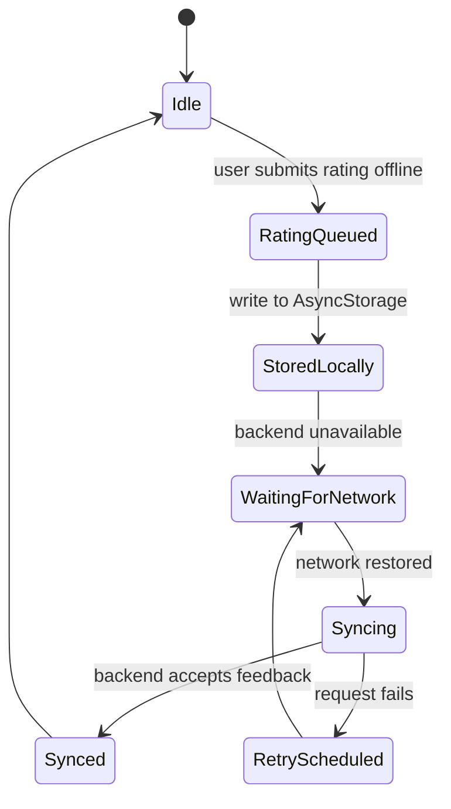

# Offline Sync State Diagram

## State Notes

| State | Meaning | Stored data |
| --- | --- | --- |
| `Idle` | No pending rating changes. | Last dish and user preferences may still be cached. |
| `RatingQueued` | A star selection was made before backend confirmation. | Dish name, nationality, rating value. |
| `StoredLocally` | Rating is saved in local storage so the UI can keep showing the user's choice. | `userRatings` in `AsyncStorage`. |
| `WaitingForNetwork` | The backend request failed or the device is offline. | Pending rating remains local. |
| `Syncing` | The app is sending the cached feedback to the backend. | Pending item plus request metadata. |
| `RetryScheduled` | Sync failed and should be attempted again later. | Same pending item, retry count if added. |
| `Synced` | Backend accepted the update. | Local cache remains as the user's latest rating. |

The current app persists ratings locally and submits them when the user taps a rating. A durable queue with retry count is the next implementation step if ratings must sync automatically after the app restarts.
