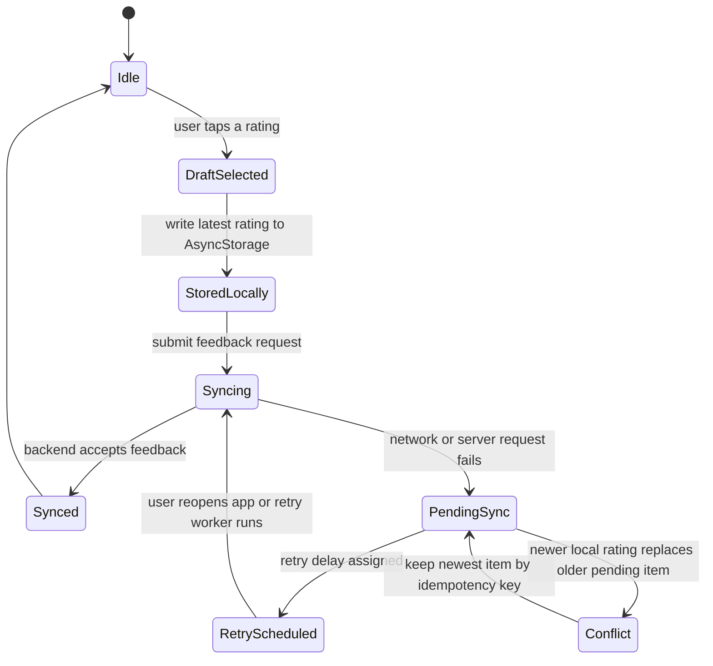

# Offline Sync State Design



## Current Implementation

The app persists the latest user-visible rating in `AsyncStorage` under
`userRatings`:

```json
{
  "Pizza Margherita": {
    "Italy": 4
  }
}
```

When a user selects a rating, the UI updates local state first, stores a durable
pending item under `pendingRatingFeedback`, and then sends
`POST /v1/dishes/:dishName/feedback` to the backend with an idempotency key. If
the request fails, the visible rating remains local and the pending item is
retried when the app starts, returns to foreground, or another rating sync
succeeds.

## Durable Queue

The app stores pending submissions separately from `userRatings`:

```json
{
  "schemaVersion": 1,
  "items": [
    {
      "idempotencyKey": "Pizza Margherita|Italy|2025-06-01T12:00:00.000Z",
      "dishName": "Pizza Margherita",
      "nationality": "Italy",
      "rating": 4,
      "feedback": "like",
      "status": "pending_sync",
      "attemptCount": 0,
      "lastAttemptAt": null,
      "createdAt": "2025-06-01T12:00:00.000Z",
      "updatedAt": "2025-06-01T12:00:00.000Z"
    }
  ]
}
```

Suggested storage keys:

| Key | Purpose |
|---|---|
| `userRatings` | Latest local rating shown in the UI |
| `pendingRatingFeedback` | Durable queue of backend feedback submissions |
| `lastDish` | Cached dish shown when reopening the app |
| `userNationality` | Saved nationality preference |

## State Notes

| State | Meaning | Stored data |
|---|---|---|
| `Idle` | No active rating change. | Cached dish and user preferences may still exist. |
| `DraftSelected` | User tapped a star rating. | Dish name, nationality, selected rating. |
| `StoredLocally` | Latest rating is visible and saved locally. | `userRatings`. |
| `Syncing` | App is submitting the mapped like/dislike feedback. | Pending queue item plus request metadata. |
| `PendingSync` | Request failed or network is unavailable. | Queue item remains durable. |
| `RetryScheduled` | Item is waiting for a later retry. | Attempt count and retry timestamp. |
| `Conflict` | A newer local rating supersedes an older queued item. | Keep newest item for the dish/nationality pair. |
| `Synced` | Backend accepted the update. | Remove queue item; keep latest `userRatings` entry. |

## Retry Policy

Recommended retry behavior:

| Attempt | Delay |
|---:|---|
| 1 | immediate retry on next foreground event |
| 2 | 30 seconds |
| 3 | 2 minutes |
| 4+ | 5 minutes, capped |

Retries should run when:

- the app starts,
- the app returns to foreground,
- a rating submission succeeds and pending items remain,
- a manual sync action is added later.

## Idempotency and Conflicts

The backend accepts an optional idempotency key through the JSON
`idempotencyKey` field or the `Idempotency-Key` header. A retry that reuses the
same key returns success without incrementing the feedback counters again.

Conflict rule:

- for the same `dishName` and `nationality`, keep only the newest pending item,
- if an older item has already synced, the newer item should be submitted as a
  separate user update,
- send `idempotencyKey` with each feedback request and reuse it for retries of
  the same queued item.

## Implementation Checklist

1. Add `pendingRatingFeedback` storage helpers.
2. Enqueue a feedback item before the network request.
3. Mark the item `syncing` during submission.
4. Remove it after a successful backend response.
5. Increment `attemptCount` after a failure.
6. Collapse pending items by `dishName` and `nationality`.
7. Send backend idempotency keys before enabling unattended retries.
8. Submit pending items on app start and foreground.
