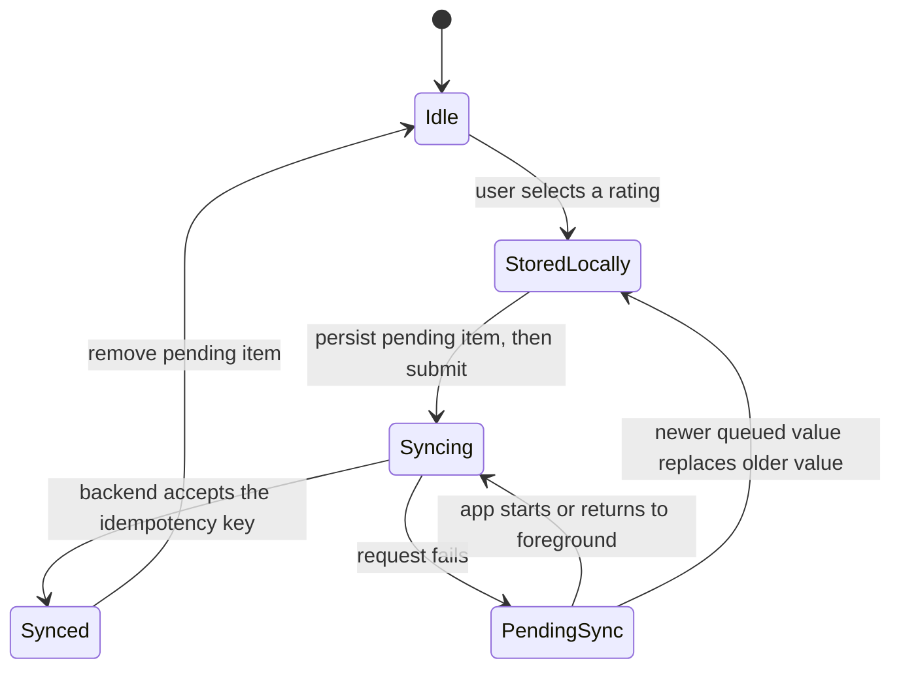

# Offline Rating Queue: Current State

This document describes the behavior implemented today. CiboCompass currently
provides an offline-resilient submission queue, not a complete multi-device
synchronization protocol. The target protocol is specified in
[offline-rating-sync-design.md](offline-rating-sync-design.md).



## Implemented Behavior

The app persists the latest user-visible rating in `AsyncStorage` under
`userRatings`. Before attempting the request, it also writes a durable item to
`pendingRatingFeedback`:

```json
{
  "schemaVersion": 1,
  "items": [
    {
      "idempotencyKey": "<dish>|<nationality>|<timestamp>",
      "dishName": "Pizza Margherita",
      "nationality": "Italy",
      "rating": 4,
      "feedback": "like",
      "status": "pending_sync",
      "attemptCount": 1,
      "lastAttemptAt": "2025-06-01T12:00:00.000Z",
      "createdAt": "2025-06-01T12:00:00.000Z",
      "updatedAt": "2025-06-01T12:00:00.000Z"
    }
  ]
}
```

Pending submissions are attempted when the app starts, returns to the
foreground, or completes another rating submission. Retries reuse the same
idempotency key. The backend records accepted keys in `FeedbackSubmissions`, so
replaying the same mutation does not increment the aggregate counters twice.

When a second unsent rating is created for the same dish and nationality, the
queue keeps the newest item. This collapse is a local queue optimization; it is
not a server-side conflict-resolution guarantee.

## Guarantees

- A rating remains visible on the device after a network failure.
- A pending submission survives an app restart through `AsyncStorage`.
- A retry with the same idempotency key is applied at most once by the backend.
- The queue attempts only one flush loop at a time within the running process.
- The latest queued value for one dish/nationality pair replaces older unsent
  values in the normal enqueue path.

## Non-Guarantees

- There is no stable user or device actor in the request or database model.
- There is no monotonic client sequence or server version.
- A newer request can reach the backend before an older request and still be
  followed by the older mutation.
- Changing a rating can increment both aggregate `like` and `dislike` counters;
  the backend cannot replace a previous actor-scoped value.
- `AsyncStorage` read-modify-write operations are not serialized across enqueue,
  removal, and failure updates, so overlapping operations can lose queue state.
- `attemptCount` is recorded, but no `nextAttemptAt`, exponential backoff,
  jitter, or dead-letter policy is implemented.
- Multi-device convergence is not provided.

## Current Retry Triggers

| Trigger | Implemented |
|---|---:|
| Initial rating submission | Yes |
| App startup | Yes |
| App returns to foreground | Yes |
| Another submission succeeds | Yes |
| Scheduled exponential backoff | No |
| Background worker | No |
| Manual retry control | No |

## Terminology

Use **offline-resilient rating queue with idempotent delivery** for the current
implementation. Reserve **offline-first synchronization** for the actor-scoped,
versioned model in [offline-rating-sync-design.md](offline-rating-sync-design.md)
after its invariants and migration tests pass.

